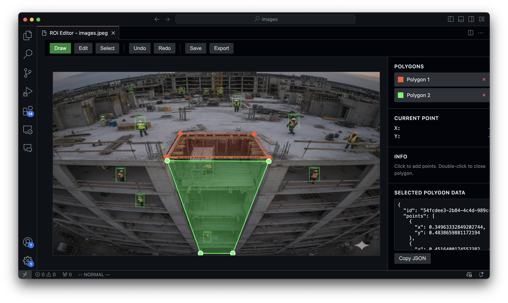

# ROI Draw



이미지 위에 폴리곤(다각형)을 그려 관심 영역(ROI) 좌표를 추출하는 VS Code 확장 프로그램입니다.

머신러닝 데이터, 이미지 영역 지정 등 다양한 작업에 활용할 수 있습니다.

## 사용 방법

### ROI 에디터 열기

**방법 1: 우클릭 메뉴**

VS Code 탐색기에서 이미지 파일을 우클릭하고 `Open ROI Editor`를 선택합니다.

**방법 2: 명령 팔레트**

`Ctrl+Shift+P` (Mac: `Cmd+Shift+P`) → `ROI Draw: Open ROI Editor` 입력 → 이미지 선택

---

### 폴리곤 그리기

| 단계 | 동작 |
|------|------|
| 1 | `Draw` 모드에서 캔버스를 클릭하여 점 추가 |
| 2 | 최소 3개 이상의 점을 찍은 후 **더블클릭**으로 폴리곤 완성 |
| 3 | 새로운 폴리곤을 그리려면 다시 클릭 |

---

### 폴리곤 수정

| 모드 | 기능 |
|------|------|
| `Edit` | 꼭짓점을 드래그하여 모양 수정 |
| `Select` | 폴리곤을 선택하고 전체를 드래그하여 이동 |

---

### 저장 및 내보내기

| 버튼 | 동작 |
|------|------|
| `Save` | 이미지와 같은 폴더에 `{파일명}.roi.json`으로 저장 |
| `Export` | JSON 데이터를 클립보드에 복사 |

---

## 단축키

| 기능 | Windows/Linux | Mac |
|------|---------------|-----|
| 실행 취소 | `Ctrl+Z` | `Cmd+Z` |
| 다시 실행 | `Ctrl+Shift+Z` | `Cmd+Shift+Z` |
| 저장 | `Ctrl+S` | `Cmd+S` |
| 삭제 | `Delete` | `Delete` |
| 취소 | `Escape` | `Escape` |

---

## 지원 이미지 형식

JPG, JPEG, PNG, GIF, WebP, BMP

---

## 저장 데이터 예시

```json
{
  "version": "1.0.0",
  "polygons": [
    {
      "id": "abc-123",
      "points": [
        { "x": 0.1, "y": 0.2 },
        { "x": 0.4, "y": 0.2 },
        { "x": 0.25, "y": 0.5 }
      ],
      "color": "#FF5733",
      "closed": true
    }
  ]
}
```

좌표는 **0~1 사이의 정규화된 값**으로 저장됩니다.
- `(0, 0)` = 이미지 왼쪽 상단
- `(1, 1)` = 이미지 오른쪽 하단
- `(0.5, 0.5)` = 이미지 중앙

이미지 해상도가 변경되어도 동일한 비율의 영역을 나타냅니다.

---

## 설정

VS Code 설정(`Ctrl+,`)에서 `roiDraw`를 검색하여 변경할 수 있습니다.

| 설정 | 기본값 | 설명 |
|------|--------|------|
| `defaultPolygonColor` | `#FF5733` | 새 폴리곤 색상 |
| `vertexSize` | `6` | 꼭짓점 크기 (px) |
| `lineWidth` | `2` | 선 두께 (px) |
| `maxUndoHistory` | `50` | Undo 기록 수 |
